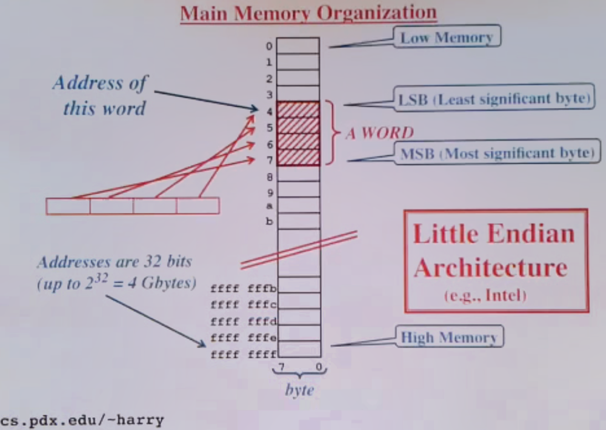
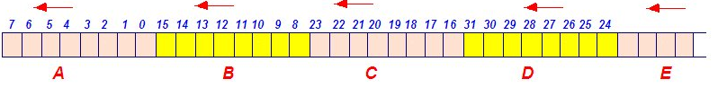
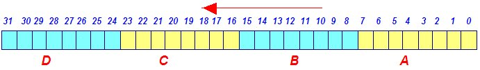
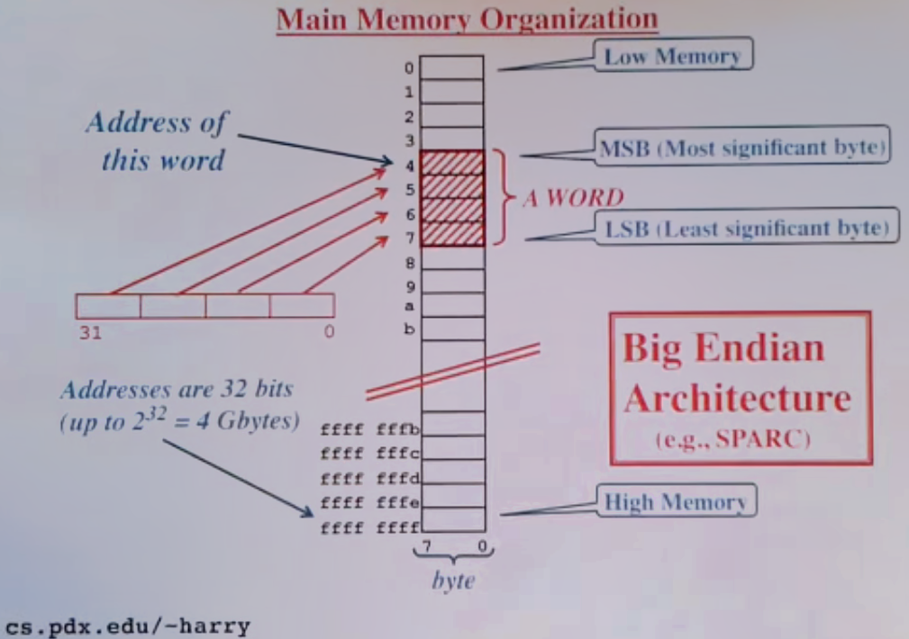

# What is endianness of a processor Little endian and Big endian #

##Endianness of a processor##
If the size of data type is more than one byte then endanness decide the memory representation of data type. 
There are two types of microprocessor according to endianness.

###Little-endian Format:###
The processors which follow the following memory representation of data are known as little-endian processor.

First A will fill then B then C then D then E and so on from right to left. Example of processor: 8085, 8086, 8088, 80286, 80386, p1, p2 etc.

###Big-endian Format:###
The processors which follow the following memory representation of data are known as big-endian processor.

First A will fill then B then C then D then E from right to left. Example of processor: Motorola, IBM PC etc.
