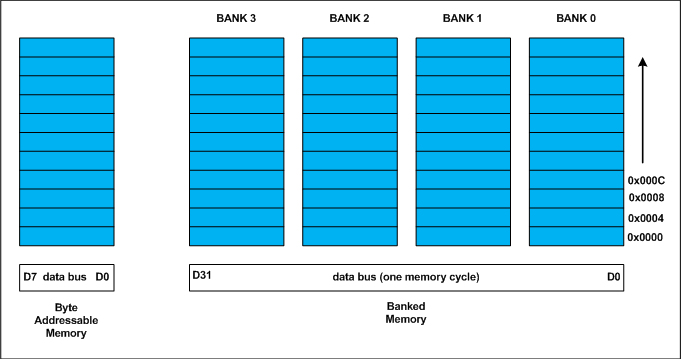
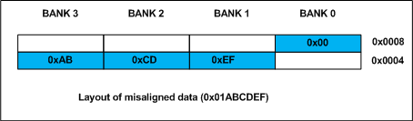

###**Data Alignment:**

Every data type in C/C++ will have alignment requirement (infact it is mandated by processor architecture, not by language). A processor will have processing word length as that of data bus size. On a 32 bit machine, the processing word size will be 4 bytes.

Historically memory is byte addressable and arranged sequentially. If the memory is arranged as single bank of one byte width, the processor needs to issue 4 memory read cycles to fetch an integer. It is more economical to read all 4 bytes of integer in one memory cycle. To take such advantage, the memory will be arranged as group of 4 banks as shown in the above figure.

The memory addressing still be sequential. If bank 0 occupies an address X, bank 1, bank 2 and bank 3 will be at (X + 1), (X + 2) and (X + 3) addresses. If an integer of 4 bytes is allocated on X address (X is multiple of 4), the processor needs only one memory cycle to read entire integer.

Where as, if the integer is allocated at an address other than multiple of 4, it spans across two rows of the banks as shown in the below figure. Such an integer requires two memory read cycle to fetch the data.

A variable’s **data alignment** deals with the way the data stored in these banks. For example, the natural alignment of **int** on 32-bit machine is 4 bytes. When a data type is naturally aligned, the CPU fetches it in minimum read cycles.

Similarly, the natural alignment of **short int** is 2 bytes. It means, a **short int** can be stored in bank 0 – bank 1 pair or bank 2 – bank 3 pair. A **double** requires 8 bytes, and occupies two rows in the memory banks. Any misalignment of **double** will force more than two read cycles to fetch **double** data.

Note that a **double** variable will be allocated on 8 byte boundary on 32 bit machine and requires two memory read cycles. On a 64 bit machine, based on number of banks, **double** variable will be allocated on 8 byte boundary and requires only one memory read cycle.

###**Structure Padding:**

In C/C++ a structures are used as data pack. It doesn’t provide any data encapsulation or data hiding features (C++ case is an exception due to its semantic similarity with classes).

Because of the alignment requirements of various data types, every member of structure should be naturally aligned. The members of structure allocated sequentially increasing order. Let us analyze each struct declared in the above program.